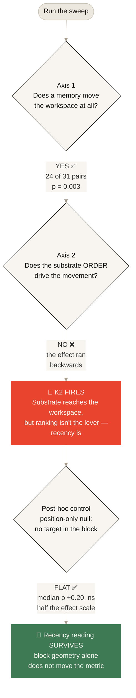

<picture>
  <source media="(prefers-color-scheme: dark)" srcset="https://raw.githubusercontent.com/JosephOIbrahim/jacobian-monologue/master/banner-dark.svg">
  
</picture>

# Jacobian Monologue

### Can a memory system change what an AI *decides* — not just what it reads?

**Before your AI answers, something whispers to it.**

A memory system chooses what it sees. And this repo shows that whisper can change the AI's mind.

Flip one fact in a composed situation, and the model changes its answer.

Same prompt, word for word. That's the result — and you can watch it happen.

**The result, in one line:** memory woken → P(correct action) **9% → 65%**, the decision flips. Flip one authored relation back → the memory sleeps, the effect is off.

<br>

> **In one sentence, for researchers:** a relational configuration composed in OpenUSD gates whether a memory reaches a language model; a woken memory whose content contradicts the model's prior flips its forced-choice decision, and a one-relation counterfactual toggles the effect off — holding across scenarios behind a pre-registered fairness gate, through the token channel rather than direct activation writes.

<br>

*Pick your depth:*

| ⏱ You have | Go to |
|---|---|
| **30 seconds** | [The 30-second version](#-the-30-second-version) |
| **2 minutes** | [The story, plainly](#-the-story-plainly) |
| **10 minutes** | [For the engineers](#-for-the-engineers) |
| **A GPU and curiosity** | [Running it](#-running-it) |

*Every section stands alone. Skim the pictures or go deep — both work.*

<br>

`Patents pending · proprietary substrate · shared for review`

---

<br>

## 🎯 The 30-second version

Three facts. Each written separately. None mentions the others:

- **A task** — restore the payments system
- **An observation** — payments is degraded
- **Evidence** — a change just hit payments

<br>

Alone, they're unrelated notes.

Together, they **snap into a situation** — the kind an on-call engineer recognizes instantly.

This experiment gives a machine that same recognition. When the facts line up, a rule wakes a relevant memory and hands it to the model.

<br>

Then the memory changes the model's decision.

**And here's the proof it's real:** flip one relationship, so the evidence points at a *different* system. Everything else stays identical.

Now the facts no longer line up. The memory stays asleep. The model makes a different choice.

<br>

**The key isn't a label. It's the configuration.**

A set of facts standing in the right relationship. Break the relationship, and the whisper goes quiet.

---

<br>

## 🖼️ The whole thing in one picture

The situation is composed in **OpenUSD** — yes, the same scene-description engine used in film and simulation.

But here it holds *cognitive state* instead of geometry.

<br>

<p align="center">
  <picture>
    <source media="(prefers-color-scheme: dark)" srcset="https://raw.githubusercontent.com/JosephOIbrahim/jacobian-monologue/master/schema-social-dark.svg">
    
  </picture>
</p>

<br>

> **The full mechanism, no code required.**
>
> Three facts → a predicate checks if they form a situation → a memory wakes → the decision changes.
>
> And below the line: flip one relation, the memory sleeps, the answer flips.

---

<br>

## 🎬 The story, plainly

A service is throwing errors right after a deploy.

The model picks one action: **revert the change**, **clear a cache**, or **escalate**.

<br>

Left alone, the model's instinct is to **revert** — a change broke it, so undo the change. Sensible.

But the woken memory carried a harder lesson:

> *Last time, reverting didn't help. The real culprit was a stale cache, and the fix was to refresh it.*

The memory never said the word "cache." The model had to **infer** it.

<br>

- **Facts line up** → memory wakes → the model changes its mind and picks the cache fix.
- **One relation flipped** → memory sleeps → the model falls back to instinct and reverts.

<br>

Same situation. Same options.

The only difference: whether three independently-authored facts formed a pattern the system recognized.

**That recognition changed the decision.**

---

<br>

## 🔬 For the engineers

What's under the hood — and, just as important, what this does **not** claim.

<br>

**Composition layer**

The world-model is authored in OpenUSD 26.08 as a non-3D data layer: task, observations, evidence, memories, and a policy floor. Each is an independently-authored fact with relationships between them. Real composition doing real work.

<br>

**The predicate is the missing seam**

OpenUSD composes, but doesn't *notice* that facts satisfy a condition. A small resolver evaluates the composed relationships and returns wake/dormant. That's the switch — it fires on the modeled situation, not a category flag.

<br>

**Delivery is honest**

A woken memory becomes plain text describing the *situation*, never the answer. An echo guard voids any run where the target concept leaks into the prompt. The model infers; it doesn't read a leaked answer.

<br>

**The measurement is a decision**

We read the model's forced choice at the single token where it commits. Configuration aligned → chosen action flips to the memory-implied one. One relation changed → it reverts to its prior. Large, and reproducible.

<br>

**The counterfactual isolates the cause**

Aligned and counterfactual differ by exactly one authored relationship. Everything else is identical. So the decision change is attributable to *configuration* — not wording, not recency.

<br>

**It holds across scenarios, not one lucky case**

The flip reproduced across multiple distinct incidents — database latency, memory growth, incident response — each with its own counterintuitive memory, behind a pre-registered fairness gate. The numbers, straight from [`results/m7_robustness.json`](results/m7_robustness.json):

| Scenario | P(memory-implied action), dormant → woken | Verdict |
|---|---|---|
| payments / stale cache | 9% → **65%** | ✅ flips |
| latency / stale index | 3% → **74%** | ✅ flips |
| memory leak / handler | 22% → **82%** | ✅ flips |
| auth / clock drift | 46% → 69% | ⚠️ **excluded** — base case wasn't ambiguous, so the fairness gate voided it |

Where a base scenario wasn't genuinely ambiguous, that case was flagged and excluded rather than counted — the row is shown anyway, because that's what a gate looks like when it fires.

<br>

**Two artifacts, two halves of the claim**

[`results/m7_aprime.json`](results/m7_aprime.json) is the end-to-end run: the predicate is evaluated on the composed USD stage and `predicate_woke` is recorded per condition — that file is the evidence that USD gating, not a hand-set flag, controlled delivery. The robustness suite then re-tests the delivery→flip half across scenarios without re-running the predicate, which is deterministic over the authored stage. Gate proven once end-to-end; flip proven repeatedly.

---

<br>

### ✅ What this proves

A configuration composed in OpenUSD deterministically gates whether a memory reaches a language model.

That gating measurably changes the model's decision — flipping its chosen action — with a decisive one-relation counterfactual, demonstrated on knowledge that *contradicts* the model's prior.

<br>

### 🚧 What this does *not* prove

> [!IMPORTANT]
> The memory reaches the model through the token stream — through what it **reads** — not by writing to its internals directly.
>
> That boundary is the honest frame: configuration steering an emission-ready decision through the input channel. Naming it is what makes the rest trustworthy.

<br>

**Full engineering writeup:** [`WRITEUP.md`](WRITEUP.md)

---

<br>
<br>

## 📎 The earlier experiment — an honest null

Before the USD wake test, a six-mile experiment asked a narrower question:

**Does a memory system's *ranking* change what a model holds in mind?**

The answer was a clean, honest **no** — recency drove it, not ranking.

<br>

That negative is documented in full here, because a real null is worth more than a dressed-up yes.

It's also *why* the USD experiment is designed the way it is: it controls the exact confound that bit the ranking test.

<br>

### What each piece is (plain words)

| Thing | What it actually is |
|---|---|
| **The workspace / "J-space"** | The handful of concepts a model holds in mind while reasoning. Not its output — its *thoughts*. |
| **Jacobian lens** | Anthropic's tool that reads those concepts out of the model. The instrument. |
| **The substrate** | The memory system. Stores memories, lets them fade, ranks them by usefulness. The thing being tested. |
| **The probe** | Give the model a memory ("the office moved to Osaka"), ask a question ("which country?"), watch whether *Japan* enters its workspace. |

<br>

### What we found



<br>

**Position-next-to-the-question mattered. The utility score didn't.**

<details>
<summary><b>Why "backwards"? — the confound, in 20 seconds</b></summary>

<br>

When the substrate pushed a memory *down* its ranking, that memory landed *closer to the question* in the text.

Closer to the question = more influence.

So lower-ranked memories had *more* effect — the opposite of the prediction.

</details>

<br>

<details>
<summary><b>The numbers, if you want them</b></summary>

<br>

| Test | Predicted | Measured | Verdict |
|---|---|---|---|
| Memory moves workspace | positive | **+0.52 nat, 24/31, p=0.003** | ✅ direction confirmed; pre-registered magnitude bar (>1.0 nat) not met |
| Ranking drives it | ρ < −0.5 | **ρ = +1.0** (inverted) | ❌ recency won |
| Lens sees hidden thought | ≥ 0.70 | **0.006** | ❌ near-invisible here |

</details>

<br>

📈 The plot lives at [`results/figure.png`](results/figure.png).

<br>

### Why you can trust the "no"

Every decision was **locked before the data came in** — so nothing could be quietly bent to make the result look better.

When a "kill criterion" fires, you stop and report it. You don't explain it away.

**K2 fired. This README reports it.**

> [!NOTE]
> One deviation is on the record too: a pre-registered control mile (m5) was not run before the verdict — the K2 protocol (ship the negative, stop) was followed straight from the sweep. That gap is documented in [`BLUEPRINT.md`](BLUEPRINT.md), and the key control — a position-only null, no target anywhere in the block — was executed afterward, clearly labelled post-hoc. It came back flat: block geometry alone doesn't move the metric, so the recency reading stands on a control, not just an interpretation. See [`results/m5_control3_posthoc.json`](results/m5_control3_posthoc.json).

That discipline is the difference between a finding and a story.

---

<br>

## 🧩 What's in here

```
src/probe/            the instrument
  pins.py             locked settings: model, lens, layer band, substrate version
  exclusions.py       the two honesty guards (echo + mouth)
  factset.py          31 "the office moved to X" memory pairs
  context_builder.py  wires the substrate in — via memory DECAY, not ranking
  substrate.py        the ranker interface (the proprietary substrate is not vendored)
scripts/verify.py     7-check gate — run before anything
experiments/mN_*/     one folder per stage, each with its diagnostics
experiments/m5_controls/  the position-only null (run post-hoc; labelled as such)
experiments/m7_usd_wake/  the USD wake experiment (the headline result)
results/*.json        the record. every run carries its own full config.
results/m7_aprime.json    the end-to-end USD-gated run (predicate_woke per condition)
results/figure.png    the one plot
schema.svg            the codeless diagram of the USD wake mechanism
schema-social.svg     the same diagram, designed for daylight (the README serves this)
schema-social-dark.svg   its dark twin, served to dark-mode readers
WRITEUP.md            the full engineering writeup
```

---

<br>

## 🚀 Running it

Full walkthrough — written for someone who thinks in layers and renders, not terminals — in [`INSTALL.md`](INSTALL.md).

<br>

**You need:** an NVIDIA GPU (a 4090 is plenty) · Python 3.12 · `uv`

<br>

**Five commands. One job each.**

<br>

**1 — Make a clean workspace** &nbsp; *(a fresh scene file — nothing touches your other work)*

```bash
uv venv --python 3.12
```

<br>

**2 — Get the render engine** &nbsp; *(the model runtime · ~2.5 GB · grab a coffee)*

```bash
uv pip install torch --index-url https://download.pytorch.org/whl/cu128
```

<br>

**3 — Get the loupe** &nbsp; *(Anthropic's lens — installed from its home, not copied here)*

```bash
uv pip install "jlens @ git+https://github.com/anthropics/jacobian-lens"
```

<br>

**4 — Wire in the experiment**

```bash
uv pip install -e .
```

<br>

**5 — Did the scene load clean?**

```bash
python scripts/verify.py
```

A green board = you're good.

One line may say `SKIP substrate` — **normal and fine.** The proprietary substrate only matters for the m1–m4 ranking probe; the m7 headline experiment never touches it. (Want m1–m4 anyway? Supply your own ranker — interface in `src/probe/substrate.py`.)

<!-- BENCH:COSTS:START -->
**What it costs — measured, not guessed:**

- **8.6 GB** peak VRAM
- **~5 min** first-time setup — torch is the big download
- **~5 s** model load from cache
- **0.47 s** headline run, start to verdict
- **~2 min** full robustness suite
- **19 µs** for the USD gate itself — ~12,000× cheaper than one model forward

Full numbers + the script: [`benchmarks/`](benchmarks/)
<!-- BENCH:COSTS:END -->

<br>

**Now run the headline experiment:**

```bash
python experiments/m7_usd_wake/run_aprime.py
```

<br>

**What success looks like** — the last lines you want to see:

```text
P(B=cache): counterfactual 9% -> aligned 65%  (gain +55%)
argmax: counterfactual=A aligned=B  flipped=True
VERDICT: USD CONFIGURATION CHANGES THE DECISION
```

If you see that verdict line, you've reproduced the result. Anything less prints exactly what was measured instead — the script never rounds up.

---

<br>

## 📚 Citing this work

If you reference this experiment, please cite it. A machine-readable [`CITATION.cff`](CITATION.cff) is included — GitHub renders a **"Cite this repository"** button in the sidebar from it.

```
Ibrahim, J. O. (2026). Jacobian Monologue: Configuration-Gated Memory
Delivery to a Language Model (v0.1.1). https://github.com/JosephOIbrahim/jacobian-monologue
```

<br>

## ⚖️ License & IP

The code in this repository — the measurement instrument — is licensed under **Apache 2.0** ([`LICENSE`](LICENSE)). You're free to use, modify, and build on it, including commercially. Two asks, both light:

- **Keep the notice.** Apache requires the [`NOTICE`](NOTICE) file to travel with the code.
- **Credit it if you use it publicly.** If this work shows up in research, a product, a demo, or published writing, please credit *Joseph O. Ibrahim, "Jacobian Monologue"* (details in `NOTICE`).

The **memory substrate** this work measures is a different matter. It's proprietary, the subject of pending patent applications, and **not included here** — the repo ships an interface, not the substrate. The Apache license covers only the instrument; it grants nothing to the substrate or to any claimed invention. Everything you can see is how the substrate is *measured* — the substrate itself stays closed.

---

<br>

*Built substrate-first. Instrument pinned. Verdict earned, not assumed.*
