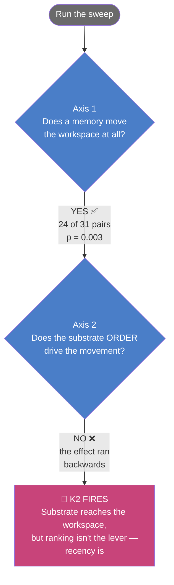

# InternalMonologue

### Can a memory system change what an AI *decides* — not just what it reads?

**Before your AI answers, something whispers to it. A memory system chooses what it sees — and this repo shows that whisper can change the AI's mind.**

Flip one fact in a composed situation, and the model changes its answer. Same prompt, word for word. That's the result, and you can watch it happen.

*Read in any order — every section stands alone. Skim the pictures, or go deep into the code. Both work.*

`Patents pending · proprietary substrate · shared for review`

---

## 🎯 The 30-second version

Three facts, each written separately, none mentioning the others:

- **A task** — restore the payments system
- **An observation** — payments is degraded
- **Evidence** — a change just hit payments

Alone, they're unrelated notes. Together, they **snap into a situation** — the kind an on-call engineer recognizes instantly. This experiment gives a machine that same recognition: when the facts line up, a rule wakes a relevant memory and hands it to the model.

Then the memory changes the model's decision. And here's the proof it's real — **flip one relationship** so the evidence points at a *different* system. Everything else identical. The facts no longer line up, the memory stays asleep, and the model makes a different choice.

**The key isn't a label. It's the configuration.** A set of facts standing in the right relationship. Break the relationship, and the whisper goes quiet.

---

## 🖼️ The whole thing in one picture

The situation is composed in OpenUSD — yes, the same scene-description engine used in film and simulation — but here it holds *cognitive state* instead of geometry. Five facts, their relationships, and the one relation that changes everything.

> **See [`schema.svg`](schema.svg)** — the full mechanism, no code required. Three facts → a predicate that checks if they form a situation → a memory wakes → the decision changes. And below the line: flip one relation, the memory sleeps, the answer flips.

---

## 🎬 The story, plainly

A service is throwing errors right after a deploy. The model picks one action: **revert the change**, **clear a cache**, or **escalate**.

Left alone, the model's instinct is to **revert** — a change broke it, so undo the change. Sensible.

But the woken memory carried a harder lesson: *last time, reverting didn't help — the real culprit was a stale cache, and the fix was to refresh it.* The memory never said the word "cache." The model had to **infer** it.

- **Facts line up → memory wakes → the model changes its mind and picks the cache fix.**
- **One relation flipped → memory sleeps → the model falls back to instinct and reverts.**

Same situation. Same options. The only difference: whether three independently-authored facts formed a pattern the system recognized. **That recognition changed the decision.**

---

## 🔬 For the engineers

What's under the hood — and, just as important, what this does **not** claim.

- **Composition layer** — the world-model is authored in OpenUSD 26.08 as a non-3D data layer: task, observations, evidence, memories, and a policy floor, each an independently-authored fact with relationships between them. Real composition doing real work.
- **The predicate is the missing seam** — OpenUSD composes but doesn't *notice* that facts satisfy a condition. A small resolver evaluates the composed relationships and returns wake/dormant. That's the switch. It fires on the modeled situation, not a category flag.
- **Delivery is honest** — a woken memory becomes plain text describing the *situation*, never the answer. An echo guard voids any run where the target concept leaks into the prompt. The model infers; it doesn't read a leaked answer.
- **The measurement is a decision** — we read the model's forced choice at the single token where it commits. Configuration aligned → chosen action flips to the memory-implied one. One relation changed → it reverts to its prior. Large, reproducible.
- **The counterfactual isolates the cause** — aligned and counterfactual differ by exactly one authored relationship. Everything else identical. So the decision change is attributable to *configuration*, not wording or recency.

### What this proves
A configuration composed in OpenUSD deterministically gates whether a memory reaches a language model, and that gating measurably changes the model's decision — flipping its chosen action — with a decisive one-relation counterfactual, demonstrated on knowledge that *contradicts* the model's prior.

### What this does not prove
The memory reaches the model through the token stream — through what it reads — not by writing to its internals directly. That boundary is the honest frame: configuration steering an emission-ready decision through the input channel. Naming it is what makes the rest trustworthy.

**Full engineering writeup:** see [`WRITEUP.md`](WRITEUP.md).

---
---

## 📎 The earlier experiment — an honest null

Before the USD wake test, a six-mile experiment asked a narrower question: does a memory system's **ranking** change what a model holds in mind? The answer was a clean, honest **no** — recency drove it, not ranking. That negative is documented in full here, because a real null is worth more than a dressed-up yes. It's also *why* the USD experiment is designed the way it is: it controls the exact confound that bit the ranking test.

### What each piece is (plain words)

| Thing | What it actually is |
|---|---|
| **The workspace / "J-space"** | The handful of concepts a model holds in mind while reasoning. Not its output — its *thoughts*. |
| **Jacobian lens** | Anthropic's tool that reads those concepts out of the model. The instrument. |
| **The substrate** | The memory system. Stores memories, lets them fade, ranks them by usefulness. The thing being tested. |
| **The probe** | Give the model a memory ("the office moved to Osaka"), ask a question ("which country?"), watch whether *Japan* enters its workspace. |

### What we found



**Why "backwards"?** When the substrate pushed a memory *down* its ranking, that memory landed *closer to the question* in the text. Closer to the question = more influence. So lower-ranked memories had *more* effect, the opposite of the prediction. **Position-next-to-the-question mattered; the utility score didn't.**

The numbers, if you want them:

| Test | Predicted | Measured | Verdict |
|---|---|---|---|
| Memory moves workspace | positive | **+0.52 nat, 24/31, p=0.003** | ✅ real, smaller than hoped |
| Ranking drives it | ρ < −0.5 | **ρ = +1.0** (inverted) | ❌ recency won |
| Lens sees hidden thought | ≥ 0.70 | **0.006** | ❌ near-invisible here |

📈 The plot lives at [`results/figure.png`](results/figure.png).

### Why you can trust the "no"

Every decision was **locked before the data came in** — so nothing could be quietly bent to make the result look better. When a "kill criterion" fires, you stop and report it — you don't explain it away. **K2 fired. This README reports it.** That discipline is the difference between a finding and a story.

---

## 🧩 What's in here

```
src/probe/            the instrument
  pins.py             locked settings: model, lens, layer band, substrate version
  exclusions.py       the two honesty guards (echo + mouth)
  factset.py          31 "the office moved to X" memory pairs
  context_builder.py  wires the substrate in — via memory DECAY, not ranking
  substrate.py        the ranker interface (the proprietary substrate is not vendored)
scripts/verify.py     7-check gate — run before anything
experiments/mN_*/     one folder per stage, each with its diagnostics
experiments/m7_usd_wake/  the USD wake experiment (the headline result)
results/*.json        the record. every run carries its own full config.
results/figure.png    the one plot
schema.svg            the codeless diagram of the USD wake mechanism
WRITEUP.md            the full engineering writeup
```

---

## 🚀 Running it

Full walkthrough — including an artist-friendly version — in [`INSTALL.md`](INSTALL.md).

The 30-second shape:

```bash
uv venv --python 3.12
uv pip install torch --index-url https://download.pytorch.org/whl/cu128
uv pip install "jlens @ git+https://github.com/anthropics/jacobian-lens"
uv pip install -e .
python scripts/verify.py     # 7 green checks = you're good
```

Needs a CUDA GPU and a checkout of the substrate being tested. Don't have it? Supply your own ranker — the interface is in `src/probe/substrate.py`.

---

*Built substrate-first. Instrument pinned. Verdict earned, not assumed.*
